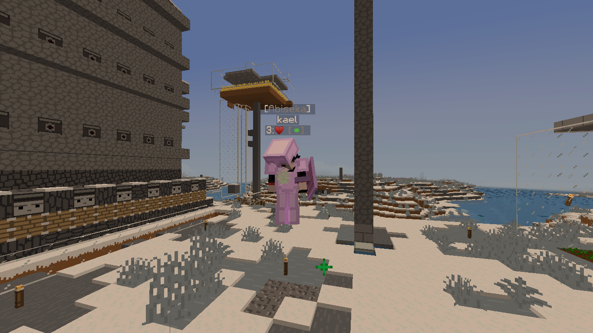

# 💡 Fitur standar

## Fitur Fitur

💸Balance

Tahukah kamu kalau DestariaMc Menggunakan Sistem Balance/Money? Balance bisa didapatkan lewat Crate dan Sell barang menggunakan <mark style="color:blue;">**\[/sell]**</mark>

🛒Shop

Kalau ada balance pasti ada shop nya dong, Kita bisa membeli Item seperti Ore,Ingots,Blocks dan bahkan spawner, kamu bisa mengakses shop di rank apa saja, <mark style="color:blue;">**\[/shop]**</mark>

💀Grave

Memang sih Keep inventory di Survival menyala, tapi tidak dengan the end dan nether, dan itulah fungsi dari <mark style="color:blue;">**\[/graves]**</mark>, kamu bisa mendapatkan barang mu yang hilang karena mati dengan bayaran beberapa Balances

🕊TempFly

TempFly atau Temporary Fly adalah fitur gratis yang bisa diakses semua rank di destaria, namun rank rank standar ada batas waktu untuk waktu terbangnya, semakin bagus rank nya semakin tinggi batas waktu nya, tidak seperti server lain yang butuh bayar dulu agar bisa terbang. <mark style="color:blue;">**\[/fly]**</mark>

### 

Seperti yang terlihat di gambar tersebut, bahkan rank Guest (Abiseka), rank yang paling rendah dapat terbang

🏬Kits

Semua rank mempunyai 1 kit, semakin tinggi rank nya semakin bagus kits nya

<mark style="color:blue;">**(Setiap enc book adalah 1 kit)**</mark>

✉Crate

Di DestariaMc Juga ada Crates loh! ada bermacam macam crates yang berisi item item yang berguna, bahkan bisa mendapatkan elytra dari crate!, Crate hanya ada di Warp gacha yang bisa kamu akses lewat <mark style="color:blue;">**\[/warp gacha]**</mark>

Kamu juga bisa mendapatkan Key crate lewat Vote

📓Vote

Mungkin setiap server ada sistem vote, namun berbeda di DestariaMc, Untuk melakukan Rankup kamu memerlukan Jumlah vote yang besar, selain itu vote juga sangat menguntungkan, kamu bisa mendapat kan 1 stack block of diamond,Beacon atau bahkan elytra lewat crates, ada juga VoteParty dimana jika Vote mencapai Goal tertentu maka semua online player akan diberi 32 Diamonds <mark style="color:blue;">**\[/vote]**</mark>

