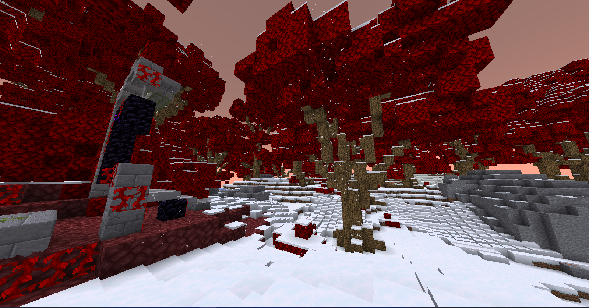

# 🏯 Dungeon Structure

Di world resource dimensi overworld, terdapat banyak dungeon dalam bentuk strcuture. Dungeon-dungeon ini dipenuhi banyak mobs dan loot yang mungkin tidak seberapa jika dibandingkan dengan jumlah dan keganasan mob yang menghuni bangunan-bangunan tersebut. Namun, di dungeon ini dapat ditemukan enchant book dengan rarity <mark style="color:red;">Very Special</mark>.\
\
Berikut ialah jenis-jenis dungeon yang dapat kalian temui di world reso:

<figure><figcaption>
Rougelike
</figcaption></figure>

### Rougelike

Dungeon ini terdiri dari koridor-koridor panjang dan banyak ruangan. Dungeon ini juga memiliki 3 level. Dimana level pertama koridor dungeon memiliki dinding dan atap berbahan kayu dan batu. Level kedua dihias hanya dengan berbagai jenis bebatuan dan level ketiga bertema Nether.

### Battle Tower

<figure><figcaption>
Battle tower
</figcaption></figure>

Sesuai namanya, dungeon ini berbentuk tower. Dimana di setiap lantai terdapat spawner dan sebuah ore-block. Setiap lantainya di isi loot yang semakin bagus setiap kali kamu naik keatas.

Ada satu jenis battle tower lagi, yaitu tipe Draylar

<figure><figcaption>
Draylar Battle tower
</figcaption></figure>

Battle tower yang satu ini agak berberda. Loot dungeon ini terdapat pada barrel yang ada di tengah-tengah setiap lantai.&#x20;

### Smoofy

<figure><figcaption>
Smoofy
</figcaption></figure>

Dungeon satu ini sangat unik dan sangat amat berbahaya. Dipenuhi banyak spawner berbagai jenis mob. Dungeon ini memiliki berbentuk sebuah lubang besar di tanah dan terdapat sebuah pohon kecil di tengahnya. Pohon tersebut dikelilingi banyak ruangan dan beberapa lantai yang dipenuhi loot chest, spawner, dan mob. Di dungeon ini terdapat beberapa jenis ruangan yang sebaiknya kamu lihat sendiri :wink:.

### Lich Tower

<figure><figcaption>
Lich tower
</figcaption></figure>

Dungeon ini berbentuk tower dengan banyak cabang. Terdapat banyak ruangan dan spawner di dalamnya. Dan di lantai tengah paling atas terdapat <mark style="color:red;">**sesuatu**</mark> yang menggungu kedatangan kalian :D!.

### Castle

<figure><figcaption></figcaption></figure>

Kalau dungeon-dungeon sebelumnya berbentuk tower atau berada di bawah tanah. Dungeon yang satu ini berbentuk kastil yang dipenuhi zombie dan creeper :D! Terdapat banyak loot dan spawner di dalamnya seperti dungeon lain. Banyak ruang-ruang berbagai jenis bahkan sebuah penjara yang berisi beberapa spawner zombie.\
