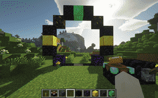
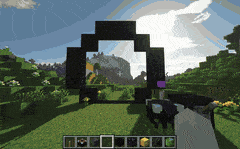

# 💫 Portals

Portal adalah struktur yang memungkinkan kamu melakukan perjalanan ke portal lain yang spesifik - sebanyak yang kamu inginkan. Kamu dapat membangunnya dengan hampir bentuk apa pun, dan menyesuaikannya dengan gaya bangunan kamu secara eksternal. Ini adalah cara terbaik untuk melakukan perjalanan jarak jauh dengan cepat. Namun, ingatlah, portal memiliki harga yang mahal!

Dengan mengklik kanan konsol portal, akan muncul menu di mana Anda dapat memilih portal tujuan yang terlihat. Setelah itu, aktifkan tuas portal dan langkahlah melalui portal tersebut.\

Bahan-Bahan yang digunakan untuk membuat portal\
.png>)&#x20;

Bingkai portal dapat dibangun dari salah satu blok batas. Tidak masalah blok mana yang Kamu gunakan, tetapi ingatlah bahwa setiap jenis block dapat kemudian diberi gaya secara individual sebagai block lain

Pertama-tama, Kamu perlu membangun bingkai portal. Bingkai tersebut dapat dibangun secara vertikal atau horizontal, tetapi umumnya varian vertikal lebih nyaman digunakan.

Bingkai portal terbentuk dari lingkaran tertutup blok dengan bentuk apa pun. Seperti portal nether, block tepi tidak dihitung, tetapi hanya blok yang menyentuh bagian dalam portal dengan setidaknya satu sisi. Ruang terkurung tersebut akan menjadi area portal.

Blok netherite, juga disebut block asal, menandai block tempat pemain tiba setelah melakukan perjalanan. Setidaknya harus ada 1x3 blok area portal di atas block netherite, sehingga pemain dapat melewati tanpa terkena damage suffocate. Dengan portal horizontal, lokasi block netherite tidak penting karena pemain selalu tiba di tengah.\
\
\
\
Selanjutnya, kamu perlu menempatkan enchantment table di tempat yang nyaman dekat dengan portalmu. Enchantment table tersebut akan menjadi konsol portal yang digunakan untuk memilih tujuan sebelum kamu melakukan perjalanan. Buatlah portal dengan menekan Shift dan mengklik kanan pada enchantment table, lalu klik kanan pada bingkai portal. Jika semua syarat yang diperlukan terpenuhi, kamu akan diminta untuk memasukkan nama untuk portal tersebut.

Terakhir, taruh levermu pada salah satu block bingkai portal, atau pada block yang berdekatan dengan konsol (kubus 3x3x3 dengan konsol di tengah) agar kamu dapat mengaktifkannya.

Perhatikan bahwa portal secara default bersifat pribadi, yang berarti hanya kamu yang dapat menggunakannya sebagai tujuan dari portal lain. Untuk mengubahnya, klik kanan pada konsol untuk membuka menu dan ubah visibilitasnya di pengaturan.\
 \
\
\
Aktifkan portal dengan memilih tujuan di konsol terlebih dahulu, kemudian aktifkan tuas. Jika portal tujuan bersifat pribadi, pemilihan tujuan akan diatur ulang setelahnya. Jika kamu memilih portal publik, pemilihan tersebut akan tetap dipertahankan setelah portal dinonaktifkan.

Portal juga dapat diaktifkan dengan menggunakan pengulang redstone yang menghadap langsung ke blok portal. Portal diaktifkan pada tepian sinyal yang meningkat. Deaktivasi terjadi setelah 10 detik seperti biasa. Hal ini hanya berfungsi jika portal tujuan tidak berada di vane-region yang membatasi akses portal dari publik!\
\
sc : vane portals
