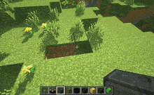
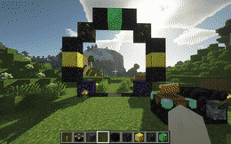
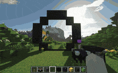

# Bajra (Advanced)

### Overview :

Advanced atau di season 2 ini disebut "Bajra" adalah rank keempat atau rank ketiga yang didapatkan melalui <mark style="color:blue;">**\[/rankup]**</mark>\
Batas durasi Flytime dari Rank Advanced meningkat menjadi 400 detik, kalian juga mendapatkan 40 detik bonus flytime setiap hari, selain itu kalian juga dapat mengakses semua trails kecuali Flash di <mark style="color:blue;">**\[/fly trails]**</mark>, Kamu bisa menggunakan portal warp untuk memindahkan villager <mark style="color:blue;">**\[/portals]**</mark>, RedProtect kalian meningkat menjadi maksimal 6 claim, Claim block limit juga meningkat ke 5000 blocks, Kalian juga dapat mengakses Night Vision tanpa potion menggunakan command <mark style="color:blue;">**\[/nv]**</mark>, dan yang tak kalah penting kalian bisa menggunakan ChestLink, Chestlink sangat berguna untuk Farm karena kalian tidak memerlukan terlalu banyak hopper untuk memindahkan item dari chest 1 ke chest 2. <mark style="color:blue;">**(Tutorial ChestLink bisa dicari di Youtube)**</mark>

<table data-view="cards"><thead><tr><th></th><th></th><th></th></tr></thead><tbody><tr><td>Basic Perks</td><td>Sethome : 3 Kit : Advanced Note : tidak bisa claim kit dibawahnya </td><td></td></tr><tr><td>Flight Crystal</td><td>Max kapasitas : 300 detik (mendapatkan 40 detik bonus flytime setiap hari) Max fly speed : 2 Bisa menggunakan semua jenis trails, kecuali flash</td><td></td></tr><tr><td>Land Claim</td><td>Max jumlah claim : 6 Max block limit : 5000 block</td><td></td></tr><tr><td>Spawner :</td><td>Dapat menaruh spawner, dan bisa mendapatkan spawner yang dihancurkan</td><td></td></tr></tbody></table>

### Daftar Command yang dapat diakses :&#x20;

Daftar command yang dapat diakses oleh Bajra hampir sama seperti rank dibawahnya tetapi hanya menambahkan beberapa command

ChestLink

"membuat group chestlink baru : /cl add \
menghapus group chestlink : /cl remove \
atur member dari grup chestlink: /cl member \
Tampilkan semua group chestlink yang kamu punya : /cl menu, /cl list \
Ganti opsi sorting untuk grup chestlink : /cl sort \
Membuka menu party : /cl party \
Buat party chestlink\
invite player ke chestlink \
Terima invite party chestlink \
buat group chestlink menjadi publik : /cl setpublic \
Ganti nama grup chestlink : /cl rename

/chestlink, /cl /cheslink add /cheslink remove /chestlink member \[add/remove ] or \[list ] /chestlink party /chestlink setpublic \<true/false> /chestlink list /chestlink rename /chestlink sort /chestlink open"

EditSign

buka dan edit kembali book yang sudah di sign : /book \
edit sign yang sudah di place : /editsign max sethome 3

/editsign /book

NightVision

Kamu bisa memakai NightVision dengan command : /nv

Portals

Portal adalah struktur yang memungkinkan kamu melakukan perjalanan ke portal lain yang spesifik - sebanyak yang kamu inginkan. Kamu dapat membangunnya dengan hampir bentuk apa pun, dan menyesuaikannya dengan gaya bangunan kamu secara eksternal. Ini adalah cara terbaik untuk melakukan perjalanan jarak jauh dengan cepat. Namun, ingatlah, portal memiliki harga yang mahal!

Dengan mengklik kanan konsol portal, akan muncul menu di mana Anda dapat memilih portal tujuan yang terlihat. Setelah itu, aktifkan tuas portal dan langkahlah melalui portal tersebut.\

Bahan-Bahan yang digunakan untuk membuat portal\
.png>)&#x20;

Bingkai portal dapat dibangun dari salah satu blok batas. Tidak masalah blok mana yang Kamu gunakan, tetapi ingatlah bahwa setiap jenis block dapat kemudian diberi gaya secara individual sebagai block lain

Pertama-tama, Kamu perlu membangun bingkai portal. Bingkai tersebut dapat dibangun secara vertikal atau horizontal, tetapi umumnya varian vertikal lebih nyaman digunakan.

Bingkai portal terbentuk dari lingkaran tertutup blok dengan bentuk apa pun. Seperti portal nether, block tepi tidak dihitung, tetapi hanya blok yang menyentuh bagian dalam portal dengan setidaknya satu sisi. Ruang terkurung tersebut akan menjadi area portal.

Blok netherite, juga disebut block asal, menandai block tempat pemain tiba setelah melakukan perjalanan. Setidaknya harus ada 1x3 blok area portal di atas block netherite, sehingga pemain dapat melewati tanpa tercekik. Dengan portal horizontal, lokasi block netherite tidak penting karena pemain selalu tiba di tengah.\
\
\
\
Selanjutnya, kamu perlu menempatkan enchantment table di tempat yang nyaman dekat dengan portalmu. Enchantment table tersebut akan menjadi konsol portal yang digunakan untuk memilih tujuan sebelum kamu melakukan perjalanan. Buatlah portal dengan menekan Shift dan mengklik kanan pada enchantment table, lalu klik kanan pada bingkai portal. Jika semua syarat yang diperlukan terpenuhi, kamu akan diminta untuk memasukkan nama untuk portal tersebut.

Terakhir, taruh levermu pada salah satu block bingkai portal, atau pada block yang berdekatan dengan konsol (kubus 3x3x3 dengan konsol di tengah) agar kamu dapat mengaktifkannya.

Perhatikan bahwa portal secara default bersifat pribadi, yang berarti hanya kamu yang dapat menggunakannya sebagai tujuan dari portal lain. Untuk mengubahnya, klik kanan pada konsol untuk membuka menu dan ubah visibilitasnya di pengaturan.\
 \
\
\
Aktifkan portal dengan memilih tujuan di konsol terlebih dahulu, kemudian aktifkan tuas. Jika portal tujuan bersifat pribadi, pemilihan tujuan akan diatur ulang setelahnya. Jika kamu memilih portal publik, pemilihan tersebut akan tetap dipertahankan setelah portal dinonaktifkan.

Portal juga dapat diaktifkan dengan menggunakan pengulang redstone yang menghadap langsung ke blok portal. Portal diaktifkan pada tepian sinyal yang meningkat. Deaktivasi terjadi setelah 10 detik seperti biasa. Hal ini hanya berfungsi jika portal tujuan tidak berada di vane-region yang membatasi akses portal dari publik!\
\
sc : vane portals

